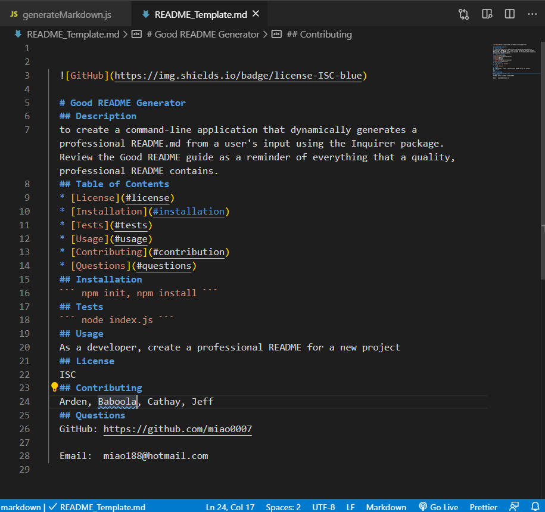

# readme_generator


    
  # Good README Generator
  ## Description
  To to create a command-line application that dynamically generates a professional README.md from a user's input using the Inquirer package. Review the Good README guide as a reminder of everything that a quality, professional README contains.
  ## Table of Contents
  * [License](#license)
  * [Installation](#installation)
  * [Tests](#tests)
  * [Usage](#usage)
  * [Contributing](#contribution)
  * [Questions](#questions)
  ## Installation
  ``` npm init, npm install ```
  ## Tests
  ``` node index.js ```
  ## Usage
  As a developer, I want to use this app to create a professional README for a new project
  ## License
  ISC
  ## Contributing
  Arden, Baboola, Cathay, Jeff
  ## Questions
  GitHub: https://github.com/miao0007
  
  Email:  miao188@hotmail.com


  ## Test Preview
  

  

  ## Deployed Video Link
https://drive.google.com/file/d/12iUPbXujz8X8usiIQQDmHP3MycIzeMR-/view?usp=sharing
  